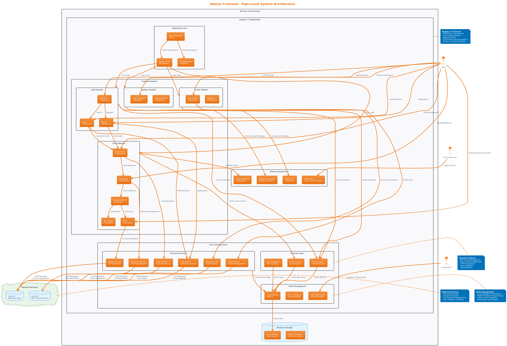
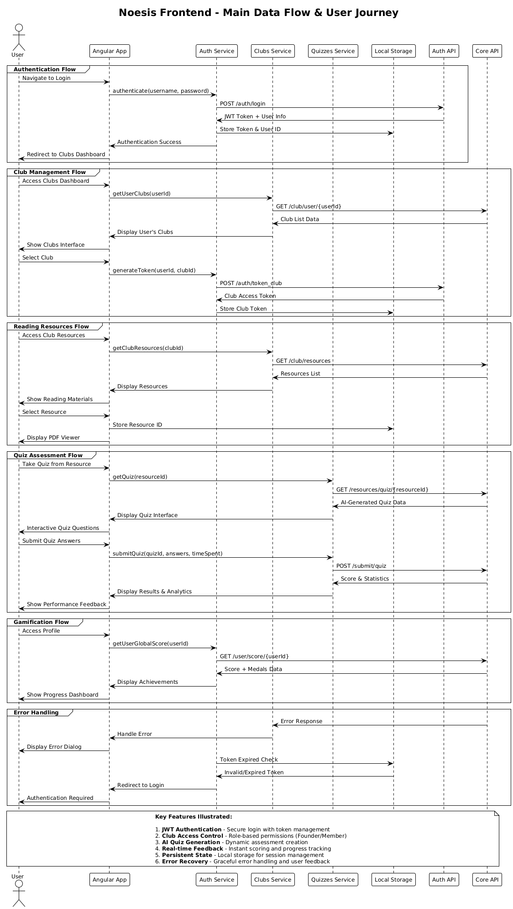
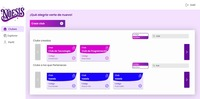
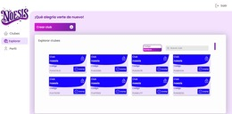
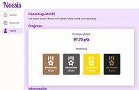
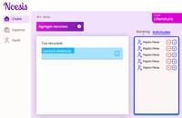
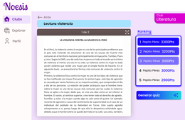
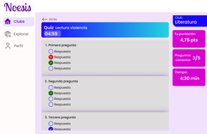

<h1 align="center">Noesis Frontend</h1>
<p align="center">
A comprehensive Angular 17 web application for the Noesis platform - an AI-powered interactive platform designed to strengthen reading comprehension through gamified learning experiences. The platform facilitates book club management, reading resource sharing, and interactive quiz-based assessment with intelligent scoring systems.
</p>

<h2 align="left">Index</h2>

- [🎯 Project Overview](#-project-overview)
- [🏗️ Architecture](#️-architecture)
  - [System Architecture Overview](#system-architecture-overview)
  - [Module Structure](#module-structure)
  - [Key Architectural Patterns](#key-architectural-patterns)
  - [Architecture Layers](#architecture-layers)
    - [1. Presentation Layer](#1-presentation-layer)
    - [2. Business Logic Layer](#2-business-logic-layer)
    - [3. Data Access Layer](#3-data-access-layer)
    - [4. Security Layer](#4-security-layer)
  - [Data Flow \& User Journey](#data-flow--user-journey)
- [🚀 Core Features](#-core-features)
  - [📚 Book Club Management](#-book-club-management)
  - [📖 Reading Resources](#-reading-resources)
  - [🧠 AI-Powered Quiz System](#-ai-powered-quiz-system)
  - [🎮 Gamification \& Progress Tracking](#-gamification--progress-tracking)
  - [👤 User Experience](#-user-experience)
- [🛠️ Technical Stack](#️-technical-stack)
  - [Frontend Technologies](#frontend-technologies)
  - [Development Tools](#development-tools)
  - [Backend Integration](#backend-integration)
- [📁 Project Structure](#-project-structure)
- [Authentication \& Security](#authentication--security)
  - [User Authentication Flow](#user-authentication-flow)
  - [Security Features](#security-features)
- [🎯 Key Components](#-key-components)
  - [Quiz System (`QuizComponent`)](#quiz-system-quizcomponent)
  - [PDF Viewer Integration](#pdf-viewer-integration)
  - [Club Management (`ClubsHomeComponent`)](#club-management-clubshomecomponent)
  - [User Profile (`ProfileHomeComponent`)](#user-profile-profilehomecomponent)
- [📊 Data Management](#-data-management)
  - [State Management](#state-management)
  - [API Integration](#api-integration)
- [🔧 Development Setup](#-development-setup)
  - [Prerequisites](#prerequisites)
  - [Installation \& Setup](#installation--setup)
  - [Available Scripts](#available-scripts)
  - [Environment Configuration](#environment-configuration)
  - [Deployment Configuration](#deployment-configuration)
- [📈 Performance Features](#-performance-features)
  - [Optimization Strategies](#optimization-strategies)
  - [Bundle Size Management](#bundle-size-management)
- [🔗 API Integration](#-api-integration)
  - [Backend Services](#backend-services)
  - [API Communication Patterns](#api-communication-patterns)
- [🎨 UI/UX Design](#-uiux-design)
  - [Design System](#design-system)
  - [User Experience Features](#user-experience-features)
  - [Snapshots](#snapshots)
- [🔮 Future Enhancements](#-future-enhancements)
- [🤝 Contributing](#-contributing)
  - [Development Guidelines](#development-guidelines)
  - [Code Quality](#code-quality)
- [👥 Authors](#-authors)
- [License](#license)

## 🎯 Project Overview

Noesis Frontend is a modern single-page application that provides users with an engaging platform for collaborative reading and comprehension assessment. The application leverages AI-generated quizzes, gamification elements, and social features to create an immersive learning environment for book clubs and individual readers.

## 🏗️ Architecture

The application follows Angular's modular architecture with clear separation of concerns:

### System Architecture Overview

The following diagram illustrates the high-level architecture of the Noesis Frontend application, showing the relationship between modules, components, services, and external systems:

[](https://raw.githubusercontent.com/NoesisTeam/noesis-frontend/refs/heads/master/rsc/img/dgr/noesis-frontend-architecture-diagram.png)

### Module Structure
- **Auth Module** - Handles user authentication and registration
- **Clubs Module** - Manages book clubs, resources, and quizzes
- **Explore Module** - Provides club discovery and browsing
- **Profile Module** - User profile management and statistics
- **Core Module** - Shared services, guards, and business logic
- **Shared Module** - Reusable components and utilities

### Key Architectural Patterns
- **Lazy Loading** - Route-based code splitting for optimal performance
- **Reactive Forms** - Form validation with custom validators
- **HTTP Interceptors** - Automatic JWT token injection
- **Route Guards** - Authentication and authorization protection
- **Standalone Components** - Modern Angular 17+ component architecture

### Architecture Layers

#### 1. Presentation Layer
- **Components**: UI components implementing Angular's reactive patterns
- **Templates**: HTML templates with data binding and directives
- **Routing**: Client-side navigation with lazy-loaded modules

#### 2. Business Logic Layer
- **Services**: Injectable services handling business operations
- **State Management**: RxJS observables for reactive data flow
- **Form Management**: Reactive forms with custom validators

#### 3. Data Access Layer
- **HTTP Client**: RESTful API communication with interceptors
- **Local Storage**: Browser storage for session persistence
- **Error Handling**: Comprehensive error management and user feedback

#### 4. Security Layer
- **Authentication Guards**: Route protection based on login status
- **Authorization Guards**: Role-based access control (Founder/Member)
- **JWT Interceptors**: Automatic token injection for API calls
- **Input Validation**: XSS prevention and data sanitization

### Data Flow & User Journey

The following sequence diagram illustrates the main data flow and user interactions within the Noesis Frontend application:

[](https://raw.githubusercontent.com/NoesisTeam/noesis-frontend/refs/heads/master/rsc/img/dgr/noesis-frontend-sequence-diagram.png)

## 🚀 Core Features

### 📚 Book Club Management
- **Club Creation** - Users can create public or private book clubs
- **Role-Based Access** - Founder and Member roles with different permissions
- **Membership Requests** - Approval system for club joining
- **Club Discovery** - Browse and search available public clubs

### 📖 Reading Resources
- **PDF Integration** - Built-in PDF viewer using ng2-pdf-viewer
- **Resource Management** - Upload, organize, and share reading materials
- **Metadata Support** - Author, title, bibliographic references
- **Access Control** - Token-based resource access within clubs

### 🧠 AI-Powered Quiz System
- **Automated Quiz Generation** - AI creates comprehension quizzes from reading materials
- **Interactive Assessment** - Multiple-choice questions with real-time feedback
- **Timer-Based Challenges** - Configurable time limits for quiz completion
- **Performance Analytics** - Detailed scoring and statistics tracking
- **Quiz Regeneration** - Founders can generate new quiz versions
- **Adaptive Difficulty** - Questions tailored to reading material complexity

### 🎮 Gamification & Progress Tracking
- **Medal System** - Achievement badges for various accomplishments
- **Global Scoring** - Comprehensive point system across all activities
- **Leaderboards** - Club and platform-wide ranking systems
- **Progress Statistics** - Detailed analytics on reading and quiz performance
- **Achievement Milestones** - Bronze, silver, gold medal classifications

### 👤 User Experience
- **Responsive Design** - Mobile-first approach with adaptive layouts
- **Real-Time Feedback** - Instant validation and progress updates
- **Accessibility** - Screen reader support and keyboard navigation
- **Progressive Loading** - Optimized loading states and spinners

## 🛠️ Technical Stack

### Frontend Technologies
- **Angular 17** - Latest Angular framework with standalone components
- **TypeScript 5.4** - Strong typing and modern JavaScript features
- **RxJS 7.8** - Reactive programming for asynchronous operations
- **Angular Router** - Client-side routing with lazy loading
- **Reactive Forms** - Form handling with validation
- **ng2-pdf-viewer 10.3** - PDF document rendering
- **date-fns 4.1** - Date manipulation utilities
- **xlsx 0.18** - Excel file processing capabilities

### Development Tools
- **Angular CLI 17.3** - Project scaffolding and build tools
- **TypeScript Compiler** - Code compilation and type checking
- **ESLint** - Code quality and style enforcement

### Backend Integration
- **Auth API** - User authentication and JWT token management
- **Core API** - Business logic, club management, and quiz processing
- **RESTful Services** - HTTP-based API communication
- **JWT Authentication** - Secure token-based authorization

## 📁 Project Structure

```
src/
├── app/
│   ├── auth/                    # Authentication module
│   │   ├── login/              # Login component
│   │   ├── signup/             # User registration
│   │   └── welcome/            # Landing page
│   ├── clubs/                  # Club management module
│   │   ├── home/               # Club dashboard
│   │   ├── quizzes/           # Quiz system
│   │   ├── resources/         # Reading materials
│   │   └── ranking-requests/  # Member management
│   ├── core/                   # Core services and utilities
│   │   ├── data/              # Data models and interfaces
│   │   ├── domain/            # Business entities
│   │   ├── guards/            # Route protection
│   │   ├── interceptors/      # HTTP interceptors
│   │   ├── services/          # Business services
│   │   └── validators/        # Custom form validators
│   ├── explore/               # Club discovery
│   ├── profile/               # User profile management
│   └── shared/                # Shared components
│       ├── components/        # Reusable UI components
│       └── constants/         # Application constants
├── assets/                    # Static resources
│   ├── ico/                  # Icons and images
│   └── img/                  # Background images
└── environments/             # Environment configurations
```

## Authentication & Security

### User Authentication Flow
1. **Registration** - Users create accounts with username/password
2. **Login** - JWT token generation and storage
3. **Token Management** - Automatic token injection via HTTP interceptors
4. **Role Authorization** - Founder/Member role-based access control
5. **Session Management** - Token expiration and refresh handling

### Security Features
- **JWT Token Protection** - Secure API communication
- **Route Guards** - Unauthorized access prevention
- **Input Validation** - XSS and injection attack prevention
- **Custom Validators** - Form security and data integrity
- **HTTPS Communication** - Encrypted data transmission

## 🎯 Key Components

### Quiz System (`QuizComponent`)
- Interactive quiz interface with timer functionality
- Real-time question navigation and option selection
- Automatic scoring and performance feedback
- Edit mode for club founders
- Statistics display with detailed analytics

### PDF Viewer Integration
- Seamless PDF document rendering
- Navigation controls and zoom functionality
- Resource metadata display
- Direct quiz access from reading materials

### Club Management (`ClubsHomeComponent`)
- Club creation and configuration
- Member invitation and approval system
- Resource sharing and organization
- Activity tracking and statistics

### User Profile (`ProfileHomeComponent`)
- Personal information management
- Achievement and medal display
- Progress tracking and analytics
- Account settings and preferences

## 📊 Data Management

### State Management
- **Local Storage** - User session and preferences
- **Service-Based State** - Shared data across components
- **Observable Patterns** - Reactive data flow
- **Form State** - Reactive form management

### API Integration
- **HTTP Client** - RESTful API communication
- **Error Handling** - Comprehensive error management
- **Loading States** - User feedback during operations
- **Caching Strategies** - Optimized data retrieval

## 🔧 Development Setup

### Prerequisites
- **Node.js** (LTS version 18+ recommended)
- **npm** (comes with Node.js)
- **Angular CLI** version 17.3.6

### Installation & Setup
```bash
# Clone the repository
git clone https://github.com/NoesisTeam/noesis-frontend.git

# Navigate to project directory
cd noesis-frontend

# Install dependencies
npm install

# Start development server
ng serve --open

# The application will be available at http://localhost:4200
```

### Available Scripts
- **`npm start`** - Start development server with hot reload
- **`npm run build`** - Build for production with optimizations
- **`npm test`** - Run unit tests with Karma
- **`npm run watch`** - Build in watch mode for development
- **`ng generate`** - Generate new components, services, etc.

### Environment Configuration
The application uses environment-specific configurations:
- **Development** - `src/environments/environment.ts`
- **Production** - `src/environments/environment.prod.ts`


### Deployment Configuration
- **Output Path** - `dist/noesis-frontend`
- **Asset Optimization** - Automatic image and code optimization
- **Bundle Analysis** - Size budgets and performance monitoring
- **Environment Variables** - API endpoint configuration

## 📈 Performance Features

### Optimization Strategies
- **Lazy Loading** - Route-based code splitting
- **OnPush Change Detection** - Optimized component rendering
- **TrackBy Functions** - Efficient list rendering
- **Async Pipe** - Memory leak prevention
- **Image Optimization** - WebP format usage

### Bundle Size Management
- **Tree Shaking** - Unused code elimination
- **Code Splitting** - Modular loading
- **Compression** - Gzip compression support
- **Caching** - Browser and CDN caching strategies

## 🔗 API Integration

### Backend Services
- **Auth API** - `https://authapi-dvz6.onrender.com/auth/`
  - User registration and authentication
  - JWT token management
  - Role-based authorization

- **Core API** - `https://noesis-coreapi.onrender.com/club/`
  - Club management operations
  - Reading resource handling
  - Quiz generation and scoring
  - User statistics and achievements

### API Communication Patterns
- **HTTP Interceptors** - Automatic token injection
- **Error Handling** - Comprehensive error management
- **Loading States** - User feedback during operations
- **Retry Logic** - Network resilience

## 🎨 UI/UX Design

### Design System
- **Custom CSS Variables** - Consistent theming
- **Responsive Grid** - Mobile-first layout
- **Component Library** - Reusable UI elements
- **Accessibility Standards** - WCAG compliance

### User Experience Features
- **Loading Spinners** - Visual feedback for operations
- **Dialog Components** - Modal interactions
- **Form Validation** - Real-time input validation
- **Navigation** - Intuitive routing and breadcrumbs

### Snapshots

Here are some representative snaps of the application:

[](https://raw.githubusercontent.com/danieltorrez29/TriviaClient/refs/heads/master/rsc/img/snp/home.png)
[](https://raw.githubusercontent.com/danieltorrez29/TriviaClient/refs/heads/master/rsc/img/snp/game.png)
[](https://raw.githubusercontent.com/danieltorrez29/TriviaClient/refs/heads/master/rsc/img/snp/stats.png)
[](https://raw.githubusercontent.com/danieltorrez29/TriviaClient/refs/heads/master/rsc/img/snp/home.png)
[](https://raw.githubusercontent.com/danieltorrez29/TriviaClient/refs/heads/master/rsc/img/snp/game.png)
[](https://raw.githubusercontent.com/danieltorrez29/TriviaClient/refs/heads/master/rsc/img/snp/stats.png)
[](https://raw.githubusercontent.com/danieltorrez29/TriviaClient/refs/heads/master/rsc/img/snp/home.png)
[](https://raw.githubusercontent.com/danieltorrez29/TriviaClient/refs/heads/master/rsc/img/snp/game.png)
[](https://raw.githubusercontent.com/danieltorrez29/TriviaClient/refs/heads/master/rsc/img/snp/stats.png)

## 🔮 Future Enhancements

- Real-time collaboration features
- Advanced AI-powered recommendations
- Mobile application development
- Enhanced accessibility features
- Multi-language support
- Advanced analytics dashboard


## 🤝 Contributing

### Development Guidelines
1. Follow Angular style guide conventions
2. Implement comprehensive unit tests
3. Use TypeScript strict mode
4. Follow reactive programming patterns
5. Maintain component isolation

### Code Quality
- **ESLint Configuration** - Code style enforcement
- **TypeScript Strict Mode** - Enhanced type safety
- **Component Architecture** - Single responsibility principle
- **Service Patterns** - Dependency injection best practices

## 👥 Authors

**Developed by the Noesis Team**

For questions, suggestions, or contributions, please contact the development team or create an issue in the repository.

## License

This project is licensed under the MIT License - see the [LICENSE](LICENSE) file for details.